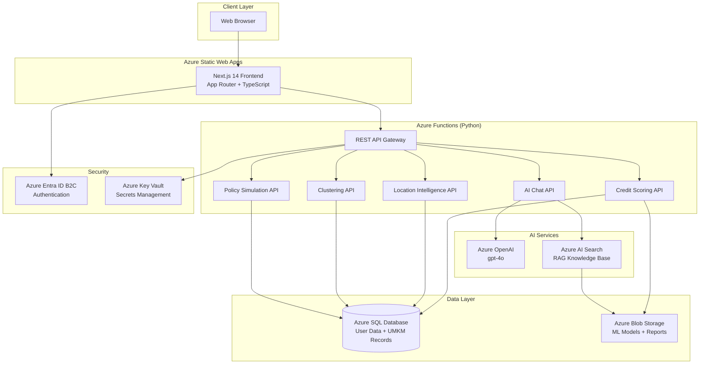

# Architecture - GeoUMKM Intelligence v4.0

## System Overview

GeoUMKM Intelligence v4.0 is a cloud-native platform for Indonesian UMKM (Micro, Small, and Medium Enterprises) intelligence. It provides credit scoring, location intelligence, clustering analysis, policy simulation, and an AI-powered chat assistant.

## Architecture Diagram



## Text-Based Architecture Diagram

```
+------------------+          +------------------------+
|   Web Browser    |          |  Azure Entra ID B2C    |
|   (Client)       |--------->|  (Authentication)      |
+--------+---------+          +------------------------+
         |
         v
+------------------+          +------------------------+
| Azure Static     |          |  Azure Key Vault       |
| Web Apps         |          |  (Secrets Management)  |
| +--------------+ |          +----------+-------------+
| | Next.js 14   | |                     |
| | App Router   | |                     |
| | TypeScript   | |                     |
| +--------------+ |                     |
+--------+---------+                     |
         |                               |
         v                               |
+------------------+                     |
| Azure Functions  |<--------------------+
| (Python 3.11)    |
| +--------------+ |     +---------------------------+
| | REST API     | |     |  Azure OpenAI (gpt-4o)    |
| | - Credit     |------>|  - Chat Completions       |
| | - Location   | |     |  - Text Analysis          |
| | - Clustering | |     +---------------------------+
| | - Policy Sim | |
| | - AI Chat    | |     +---------------------------+
| +--------------+ |---->|  Azure AI Search          |
+--------+---------+     |  - RAG Knowledge Base     |
         |               |  - UMKM Document Index    |
         v               +---------------------------+
+------------------+
| Azure SQL        |     +---------------------------+
| Database         |     |  Azure Blob Storage       |
| - User accounts  |     |  - ML Models (XGBoost)    |
| - UMKM records   |     |  - Exported Reports       |
| - Credit scores  |     |  - Static Assets          |
| - Cluster data   |     +---------------------------+
+------------------+
```

## Component Details

### Frontend - Next.js 14 on Azure Static Web Apps

- **Technology:** Next.js 14, TypeScript, Tailwind CSS, Framer Motion
- **Hosting:** Azure Static Web Apps (Free tier)
- **Deployment:** GitHub Actions CI/CD on push to main
- **Features:**
  - Landing page with premium animations
  - Dashboard with sidebar navigation
  - Credit Scoring visualization
  - Location Intelligence maps
  - Clustering analysis views
  - Policy Simulation interface
  - AI Chat assistant (floating panel)
  - Authentication pages (login/register)

### Backend - Azure Functions (Python)

- **Technology:** Python 3.11, Azure Functions v4
- **Hosting:** Consumption plan (serverless, pay-per-execution)
- **Endpoints:**
  - `POST /api/credit-score` - Calculate UMKM credit scores
  - `POST /api/location/analyze` - Location intelligence analysis
  - `POST /api/clustering/run` - Run clustering algorithms
  - `POST /api/policy/simulate` - Policy simulation
  - `POST /api/chat` - AI chat with RAG
  - `GET /api/umkm/{id}` - Get UMKM details
  - `GET /api/reports` - List generated reports
  - `POST /api/reports/export` - Export report to PDF/Excel

### Database - Azure SQL

- **Tier:** Basic (5 DTU) for development, Standard for production
- **Tables:**
  - `users` - User accounts and preferences
  - `umkm_records` - UMKM business data
  - `credit_scores` - Calculated credit scores with history
  - `clusters` - Clustering results and assignments
  - `location_data` - Geospatial data for UMKM locations
  - `policy_simulations` - Saved simulation results
  - `chat_history` - User chat conversation history

### AI Layer - Azure OpenAI + AI Search

- **Azure OpenAI:**
  - Model: gpt-4o (latest, multimodal capable)
  - Use cases: Chat completions, text analysis, report generation
  - Integration: Python SDK via Azure Functions

- **Azure AI Search (RAG):**
  - Indexes UMKM knowledge base documents
  - Provides relevant context to OpenAI for grounded responses
  - Supports semantic search over business data
  - Document sources: Government regulations, industry reports, UMKM guides

### Storage - Azure Blob Storage

- **Containers:**
  - `models/` - Trained ML models (XGBoost for credit scoring, K-Means for clustering)
  - `assets/` - Public static assets (images, icons)
  - `exports/` - Generated reports (PDF, Excel, CSV)
- **Access:** Private (models, exports), Public read (assets)

### Authentication - Azure Entra ID B2C

- **Features:**
  - Email-based sign-up and sign-in
  - Password reset flow
  - Profile editing
  - Token-based authentication (JWT)
- **Integration:** Static Web Apps built-in auth or MSAL library

### Security - Azure Key Vault

- **Stored Secrets:**
  - SQL connection string
  - OpenAI API key and endpoint
  - AI Search admin key
  - Blob Storage connection string
  - B2C client credentials
- **Access:** Managed Identity (Function App auto-authenticates)

## Data Flow

### 1. User Authentication Flow

```
Browser -> Static Web Apps -> Entra ID B2C -> JWT Token -> Browser
Browser -> API Request (with JWT) -> Functions -> Validate Token -> Process Request
```

### 2. Credit Scoring Flow

```
User submits UMKM data -> Functions API -> Load XGBoost model from Blob
-> Query historical data from SQL -> Calculate score -> Store result in SQL
-> Return score + explanation to frontend
```

### 3. AI Chat Flow (RAG)

```
User sends message -> Functions API -> Query AI Search for relevant docs
-> Construct prompt with context -> Send to Azure OpenAI (gpt-4o)
-> Stream response back to frontend -> Store in chat_history (SQL)
```

### 4. Report Export Flow

```
User requests export -> Functions API -> Query data from SQL
-> Generate PDF/Excel -> Upload to Blob Storage (exports container)
-> Return download URL to frontend
```

## Directory Structure

```
geoumkm-smart-3/
├── frontend/                    # Next.js 14 application
│   ├── app/                     # App Router pages
│   │   ├── (landing)/           # Landing page routes
│   │   ├── (dashboard)/         # Dashboard routes
│   │   └── (auth)/              # Authentication routes
│   ├── components/              # React components
│   │   ├── landing/             # Landing page components
│   │   ├── dashboard/           # Dashboard components
│   │   └── chat/                # Chat panel components
│   ├── lib/                     # Utility functions
│   ├── public/                  # Static assets
│   ├── package.json             # Dependencies
│   ├── next.config.js           # Next.js configuration
│   ├── tailwind.config.ts       # Tailwind CSS config
│   └── tsconfig.json            # TypeScript config
├── api/                         # Azure Functions (Python) - placeholder
│   ├── function_app.py          # Main function app
│   ├── requirements.txt         # Python dependencies
│   └── host.json                # Functions host config
├── ml/                          # Machine Learning assets
│   ├── notebooks/               # Jupyter notebooks
│   ├── data/                    # Training/reference data
│   ├── models/                  # Trained model files
│   └── scripts/                 # ML pipeline scripts
├── docs/                        # Documentation
│   ├── AZURE_SETUP_GUIDE.md     # Azure setup instructions
│   ├── ARCHITECTURE.md          # This file
│   └── assets/                  # Documentation assets
├── .github/
│   └── workflows/
│       └── deploy-frontend.yml  # CI/CD workflow
├── staticwebapp.config.json     # Static Web Apps config
└── README.md                    # Project overview
```

## Technology Stack

| Layer | Technology | Purpose |
|-------|-----------|---------|
| Frontend | Next.js 14 | React framework with App Router |
| Styling | Tailwind CSS | Utility-first CSS |
| Animation | Framer Motion | UI animations |
| Icons | Lucide React | Icon library |
| Language | TypeScript | Type-safe JavaScript |
| Backend | Azure Functions | Serverless API |
| Runtime | Python 3.11 | Backend language |
| Database | Azure SQL | Relational data store |
| AI Model | Azure OpenAI (gpt-4o) | Chat and analysis |
| Search | Azure AI Search | RAG knowledge retrieval |
| Storage | Azure Blob Storage | File storage |
| Auth | Azure Entra ID B2C | User authentication |
| Secrets | Azure Key Vault | Secrets management |
| CI/CD | GitHub Actions | Automated deployment |
| Hosting | Azure Static Web Apps | Frontend hosting |

## Deployment

The platform uses a fully automated CI/CD pipeline:

1. Developer pushes code to `main` branch
2. GitHub Actions triggers on changes to `frontend/**`
3. Workflow installs dependencies and builds the Next.js application
4. Built output is deployed to Azure Static Web Apps
5. Static Web Apps serves the frontend globally with CDN

Backend (Azure Functions) is deployed separately via Azure CLI or a dedicated workflow.

## Scaling Considerations

- **Frontend:** Azure Static Web Apps scales automatically (global CDN)
- **Backend:** Consumption plan auto-scales based on demand (0 to N instances)
- **Database:** Upgrade from Basic to Standard/Premium as data grows
- **AI Services:** Increase token rate limits as usage grows
- **Search:** Upgrade from Free to Basic tier for production workloads
