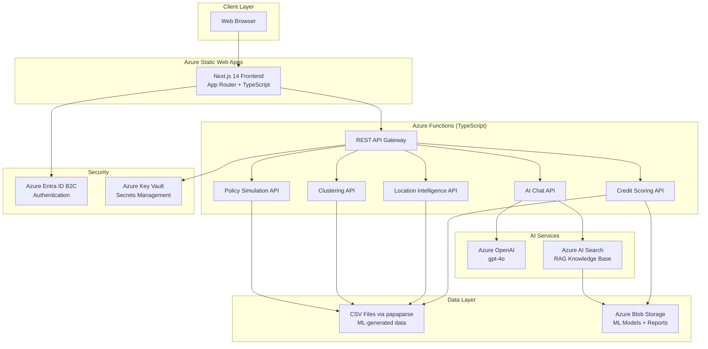

# Architecture - GeoUMKM Intelligence v4.0

## System Overview

GeoUMKM Intelligence v4.0 is a cloud-native platform for Indonesian UMKM (Micro, Small, and Medium Enterprises) intelligence. It provides credit scoring, location intelligence, clustering analysis, policy simulation, and an AI-powered chat assistant.

## Architecture Diagram



## Text-Based Architecture Diagram

```
+------------------+          +------------------------+
|   Web Browser    |          |  Azure Entra ID B2C    |
|   (Client)       |--------->|  (Authentication)      |
+--------+---------+          +------------------------+
         |
         v
+------------------+          +------------------------+
| Azure Static     |          |  Azure Key Vault       |
| Web Apps         |          |  (Secrets Management)  |
| +--------------+ |          +----------+-------------+
| | Next.js 14   | |                     |
| | App Router   | |                     |
| | TypeScript   | |                     |
| +--------------+ |                     |
+--------+---------+                     |
         |                               |
         v                               |
+------------------+                     |
| Azure Functions  |<--------------------+
| (TypeScript /    |
|  Node.js 22)     |
| +--------------+ |     +---------------------------+
| | REST API     | |     |  Azure OpenAI (gpt-4o)    |
| | - Chat       |------>|  - Chat Completions       |
| | - Cluster    | |     |  - Text Analysis          |
| | - Credit     | |     +---------------------------+
| | - Kecamatan  | |
| | - Overview   | |     +---------------------------+
| | - Policy     | |---->|  Azure AI Search          |
| | - Recommend  | |     |  - RAG Knowledge Base     |
| | - Score      | |     |  - UMKM Document Index    |
| | - What-If    | |     +---------------------------+
| +--------------+ |
+--------+---------+
         |
         v
+------------------+
| CSV Data Files   |     +---------------------------+
| (via papaparse)  |     |  Azure Blob Storage       |
| - ML outputs     |     |  - ML Models (XGBoost)    |
| - UMKM records   |     |  - Exported Reports       |
| - Cluster data   |     |  - Static Assets          |
+------------------+     +---------------------------+
```

## Component Details

### Frontend - Next.js 14 on Azure Static Web Apps

- **Technology:** Next.js 14, TypeScript, Tailwind CSS, Framer Motion
- **Hosting:** Azure Static Web Apps (Free tier)
- **Deployment:** GitHub Actions CI/CD on push to main
- **Features:**
  - Landing page with premium animations
  - Dashboard with sidebar navigation
  - Credit Scoring visualization
  - Location Intelligence maps
  - Clustering analysis views
  - Policy Simulation interface
  - AI Chat assistant (floating panel)
  - Authentication pages (login/register)

### Backend - Azure Functions (TypeScript)

- **Technology:** TypeScript (Node.js 22), Azure Functions v4, papaparse
- **Hosting:** Consumption plan (serverless, pay-per-execution)
- **Data Loading:** CSV files parsed at runtime via papaparse (SQL planned for future)
- **Endpoints:**
  - `POST /api/chat` - AI chat with RAG
  - `GET /api/cluster` - Clustering analysis data
  - `GET /api/credit` - Credit scoring data and bands
  - `GET /api/kecamatan` - Kecamatan-level data
  - `GET /api/overview` - Dashboard overview statistics
  - `GET /api/policy` - Policy simulation data
  - `GET /api/recommend` - Location recommendations
  - `GET /api/score` - Location scoring data
  - `POST /api/whatif` - What-If policy simulation

### Data Layer - CSV via papaparse

- **Current State:** Data is loaded from CSV files generated by ML notebooks
- **Future Plan:** Migrate to Azure SQL Database for production
- **Data Sources:**
  - `ml/data/` - ML pipeline output CSVs
  - `api/src/data/` - Data loader module

### AI Layer - Azure OpenAI + AI Search

- **Azure OpenAI:**
  - Model: gpt-4o (latest, multimodal capable)
  - Use cases: Chat completions, text analysis, report generation
  - Integration: Azure OpenAI SDK via TypeScript

- **Azure AI Search (RAG):**
  - Indexes UMKM knowledge base documents
  - Provides relevant context to OpenAI for grounded responses
  - Supports semantic search over business data
  - Document sources: Government regulations, industry reports, UMKM guides

### Storage - Azure Blob Storage

- **Containers:**
  - `models/` - Trained ML models (XGBoost for credit scoring, K-Means for clustering)
  - `assets/` - Public static assets (images, icons)
  - `exports/` - Generated reports (PDF, Excel, CSV)
- **Access:** Private (models, exports), Public read (assets)

### Authentication - Azure Entra ID B2C

- **Features:**
  - Email-based sign-up and sign-in
  - Password reset flow
  - Profile editing
  - Token-based authentication (JWT)
- **Integration:** Static Web Apps built-in auth or MSAL library

### Security - Azure Key Vault

- **Stored Secrets:**
  - OpenAI API key and endpoint
  - AI Search admin key
  - Blob Storage connection string
  - B2C client credentials
- **Access:** Managed Identity (Function App auto-authenticates)

## Data Flow

### 1. User Authentication Flow

```
Browser -> Static Web Apps -> Entra ID B2C -> JWT Token -> Browser
Browser -> API Request (with JWT) -> Functions -> Validate Token -> Process Request
```

### 2. Credit Scoring Flow

```
User requests credit data -> Functions API -> Load CSV via papaparse
-> Parse and filter UMKM records -> Calculate aggregations
-> Return score bands + explanations to frontend
```

### 3. AI Chat Flow (RAG)

```
User sends message -> Functions API -> Query AI Search for relevant docs
-> Construct prompt with context -> Send to Azure OpenAI (gpt-4o)
-> Stream response back to frontend
```

### 4. Policy Simulation Flow

```
User submits what-if parameters -> Functions API -> Load baseline data from CSV
-> Apply policy adjustments -> Calculate projected impacts
-> Return simulation results to frontend
```

## Directory Structure

```
geoumkm-smart-3/
├── frontend/                    # Next.js 14 application
│   ├── app/                     # App Router pages
│   │   ├── (landing)/           # Landing page routes
│   │   ├── (dashboard)/         # Dashboard routes
│   │   └── (auth)/              # Authentication routes
│   ├── components/              # React components
│   │   ├── landing/             # Landing page components
│   │   ├── dashboard/           # Dashboard components
│   │   └── chat/                # Chat panel components
│   ├── lib/                     # Utility functions & static data
│   ├── public/                  # Static assets
│   ├── package.json             # Dependencies
│   ├── next.config.js           # Next.js configuration
│   ├── tailwind.config.ts       # Tailwind CSS config
│   └── tsconfig.json            # TypeScript config
├── api/                         # Azure Functions (TypeScript)
│   ├── src/
│   │   ├── functions/           # Function endpoints (chat, cluster, credit, etc.)
│   │   ├── data/                # Data loader (CSV via papaparse)
│   │   └── shared/              # Shared types & utilities
│   ├── host.json                # Functions host config
│   ├── package.json             # Dependencies (@azure/functions, papaparse)
│   └── tsconfig.json            # TypeScript config
├── ml/                          # Machine Learning assets
│   ├── notebooks/               # Jupyter notebooks (01-08)
│   ├── data/                    # Generated data & knowledge base
│   ├── models/                  # Trained model files (.joblib)
│   └── scripts/                 # ML pipeline build scripts
├── docs/                        # Documentation
│   ├── ARCHITECTURE.md          # This file
│   ├── AZURE_SETUP_GUIDE.md     # Azure setup instructions
│   ├── PROJECT_STATUS_AND_ROADMAP.md
│   └── assets/                  # Documentation assets (charts, diagrams)
├── .github/
│   └── workflows/
│       └── deploy-frontend.yml  # CI/CD workflow
└── README.md                    # Project overview
```

## Technology Stack

| Layer | Technology | Purpose |
|-------|-----------|---------|
| Frontend | Next.js 14 | React framework with App Router |
| Styling | Tailwind CSS | Utility-first CSS |
| Charts | Recharts | Data visualization |
| Maps | React-Leaflet | Interactive map components |
| Animation | Framer Motion | UI animations |
| Icons | Lucide React | Icon library |
| Language | TypeScript | Type-safe JavaScript (frontend + backend) |
| Backend | Azure Functions v4 | Serverless API |
| Runtime | Node.js 22 | Backend runtime |
| Data Parsing | papaparse | CSV parsing at runtime |
| AI Model | Azure OpenAI (gpt-4o) | Chat and analysis |
| Search | Azure AI Search | RAG knowledge retrieval |
| Storage | Azure Blob Storage | File storage |
| Auth | Azure Entra ID B2C | User authentication |
| Secrets | Azure Key Vault | Secrets management |
| CI/CD | GitHub Actions | Automated deployment |
| Hosting | Azure Static Web Apps | Frontend hosting |

## Deployment

The platform uses a fully automated CI/CD pipeline:

1. Developer pushes code to `main` branch
2. GitHub Actions triggers on changes to `frontend/**`
3. Workflow installs dependencies and builds the Next.js application
4. Built output is deployed to Azure Static Web Apps
5. Static Web Apps serves the frontend globally with CDN

Backend (Azure Functions) is deployed separately via Azure CLI or a dedicated workflow.

## Scaling Considerations

- **Frontend:** Azure Static Web Apps scales automatically (global CDN)
- **Backend:** Consumption plan auto-scales based on demand (0 to N instances)
- **Data:** Migrate from CSV to Azure SQL Database as data grows
- **AI Services:** Increase token rate limits as usage grows
- **Search:** Upgrade from Free to Basic tier for production workloads
